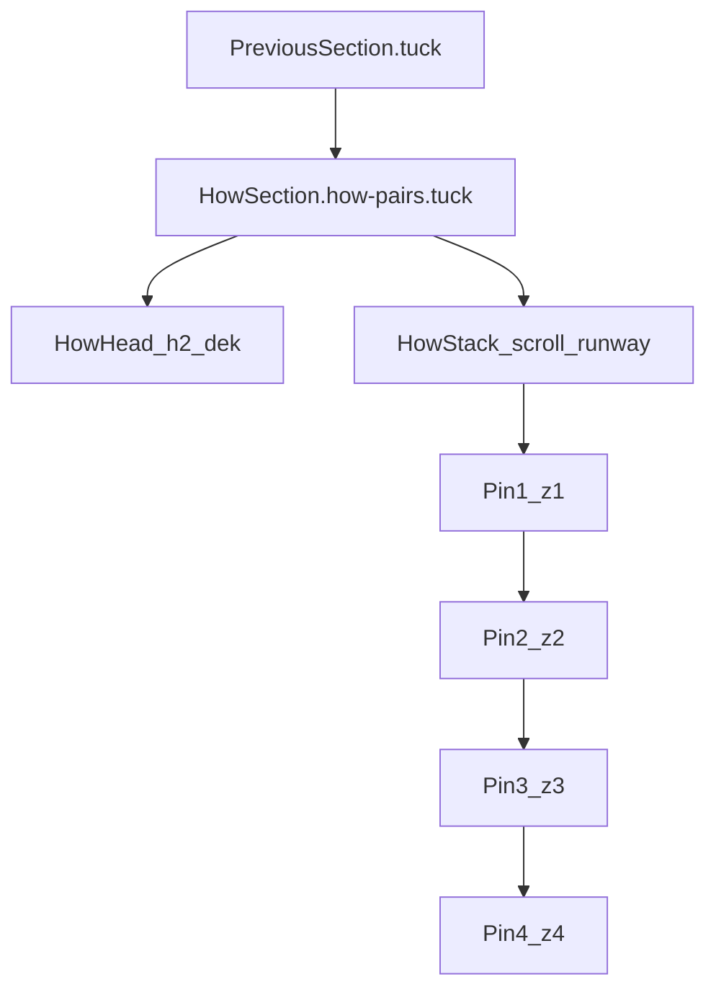

# How Section — React / Next.js Replication Guide

Handoff for porting **Section 3: How It Works** (`#how`) — the **"Removes friction so you can focus on what matters."** block — into a React or Next.js project.

**Companion doc (vanilla/CSS/DOM depth):** [HOW-SECTION-REPLICATION.md](./HOW-SECTION-REPLICATION.md)

---

## 1. What you are replicating

This is not just a headline. The full section includes:

1. **Section tuck** — curved transition from the dark section above into a cream background
2. **Static headline** — centered `h2` + dek (scrolls away normally; never sticky)
3. **Sticky card stack (desktop only)** — four principle + product cards that layer on scroll
4. **Animated product mocks** — four in-card UI slideshows (vanilla JS today)



### Source files in this repo

| Concern | Path | Lines (approx.) |
|---------|------|-----------------|
| HTML / JSX source | `index.html` | `#how` ~282–710 |
| Styles | `styles-v3.css` | See [§ CSS extraction](#12-css-extraction-how-sectioncss) |
| Sticky stack | `src/how-stack.js` | Full file (~106 lines) |
| Mock slideshows | `src/how-mocks.js` | Full file (~857 lines) |
| Vanilla reference | `docs/HOW-SECTION-REPLICATION.md` | Full DOM/mock specs |

**Do not copy:** `_archive/index-v3.html` (legacy flat layout without sticky stack).

---

## 2. Critical behavior (read before porting)

### Desktop sticky stack — no CSS scroll-snap

The “snap” feel comes from:

1. Four overlapping `position: sticky` wrappers (`.how-stack__pin`) pinned at the same `top`
2. Increasing `z-index` (1 → 4) so each card covers the previous
3. A tall scroll runway on `.how-stack` (`min-height: calc(var(--stack-step) * 4 - 32px)`)

There is **no** `scroll-snap-type`.

### Mobile and reduced motion → flat list

`src/how-stack.js` treats **viewport ≤ 980px** and **`prefers-reduced-motion: reduce`** as flat layout by adding `.how-stack--static`:

```js
function isFlatLayout() {
  return mqStatic.matches || mqMobile.matches;
}
```

On mobile, cards appear as a **vertical list with dividers** — not sticky handoffs. The vanilla doc §7–8 previously described mobile sticky measurement; that is **outdated**. See the correction in [HOW-SECTION-REPLICATION.md](./HOW-SECTION-REPLICATION.md).

### Sticky offset must match your nav

`--stack-top` defaults to **88px** desktop / **72px** in mobile CSS overrides. Tune to your fixed header height.

### Tuck depends on the section above

`section.how-pairs.tuck` expects a preceding `section.*.tuck` (here: `problem-forest`). Without it, the curved transition and z-index layering look wrong. Either replicate the tuck system or remove `.tuck` and use normal section padding.

---

## 3. React component architecture

### Recommended component tree

```
components/marketing/HowSection/
├── HowSection.tsx          "use client" — section shell + init
├── HowHead.tsx             static h2 + dek
├── HowStack.tsx            .how-stack wrapper
├── HowStackPin.tsx         .how-stack__pin
├── HowCard.tsx             article.pair.how-stack__card
├── PrincipleColumn.tsx     .principle
├── ProductColumn.tsx       .product > .viz-frame
└── mocks/
    ├── FocusSessionMock.tsx
    ├── BlockedItemsMock.tsx
    ├── GuidedSessionMock.tsx
    └── VisualProgressMock.tsx
```

**Keep the same BEM class names** when porting CSS verbatim — avoids rewriting hundreds of selectors.

### Strategy A — Fastest fidelity (recommended first)

1. Convert `index.html` `#how` markup to JSX (`className`, `htmlFor`, self-closing tags)
2. Import CSS globally (`import "./how-section.css"` or in `app/globals.css`)
3. Copy `how-stack.js` and `how-mocks.js` into `lib/` unchanged
4. Call `initHowMocks()` + `initHowStack()` from `useEffect` in a client component

**Pros:** Pixel-match quickly. **Cons:** Imperative DOM; React Strict Mode double-mount needs a guard (see §6).

### Strategy B — Idiomatic React (later refactor)

1. Replace `initHowStack` with `useHowStack(stackRef)` (same logic, ref-based)
2. Replace each mock with a React state machine + `useIntersectionObserver` hook
3. Keep CSS class names for styling continuity

Choose B only if you need Storybook isolation, SSR-safe animation state, or to drop the large mock HTML blocks.

---

## 4. Implementation phases

### Phase 1 — Design tokens and layout shell

Copy minimal `:root` tokens from `styles-v3.css` (lines 5–93). Required subset:

| Token | Value | Used for |
|-------|-------|----------|
| `--bg` | `#F9F7F4` | Section + card background |
| `--surface` | `#FFFFFF` | Viz frame |
| `--ink`, `--ink-2`, `--ink-3` | grays | Body copy |
| `--flame`, `--flame-soft` | orange | Accent, `.num` pill |
| `--cyan`, `--cyan-2` | teal | Guided rest state, heatmap |
| `--line` | `rgba(43,43,43,0.10)` | Borders |
| `--font-display` | Space Grotesk | `h2`, `h3` |
| `--font-sans` | system UI | Body, bullets |
| `--font-mono` | JetBrains Mono | `.num`, timers |
| `--section-pad` | `112px` (80px at ≤620px) | Section padding |
| `--tuck-r` | `54px` | Curve radius |
| `--r-2xl` | `36px` | Card radius |
| `--shadow-lg` | see CSS | Card + viz elevation |
| `--pair-pad` | `56px` | Static pair padding |

Also copy `.wrap` (line 158):

```css
.wrap { max-width: 1240px; margin: 0 auto; padding: 0 32px; }
```

**Next.js fonts** — `app/layout.tsx`:

```tsx
import { Space_Grotesk, JetBrains_Mono } from "next/font/google";

const spaceGrotesk = Space_Grotesk({
  subsets: ["latin"],
  weight: ["500", "600", "700"],
  variable: "--font-display",
});

const jetbrainsMono = JetBrains_Mono({
  subsets: ["latin"],
  weight: ["400", "500"],
  variable: "--font-mono",
});

export default function RootLayout({ children }) {
  return (
    <html lang="en" className={`${spaceGrotesk.variable} ${jetbrainsMono.variable}`}>
      <body>{children}</body>
    </html>
  );
}
```

Or use a Google Fonts `<link>` in `layout.tsx` if you prefer.

### Phase 2 — Section markup (DOM contract)

Preserve this structure exactly:

```tsx
<section className="how-pairs tuck" id="how" aria-labelledby="how-heading">
  <div className="wrap">
    <div className="how-head">
      <h2 id="how-heading">
        YourProduct <em>Removes friction</em> so you can focus on what matters.
      </h2>
      <p>Your dek line — e.g. four integrated systems, one rhythm.</p>
    </div>

    <div className="how-stack" aria-label="How it works">
      {/* Exactly 4× .how-stack__pin > article.pair.how-stack__card */}
    </div>
  </div>
</section>
```

**Rules that break the effect if violated:**

| Rule | Why |
|------|-----|
| `h2` stays **outside** `.how-stack` | Otherwise title sticks or collides with cards |
| Exactly **four** `.how-stack__pin` children | Runway math assumes four steps |
| Pairs 2 and 4: `reverse` on `<article>` | Alternating product/principle columns on desktop |
| Each card: `.principle` + `.product > .viz-frame` | Grid layout depends on this |
| Mock root IDs preserved | JS looks up by ID; missing IDs = silent no-op |

Copy all four pairs from `index.html` including mock HTML. Required IDs:

| Pair | Root ID |
|------|---------|
| 1 | `focusSessionMock` |
| 2 | `blockedItemsMock` |
| 3 | `guidedSessionMock` |
| 4 | `visualProgressMock` |

### Phase 3 — CSS port

Extract blocks from `styles-v3.css` into `how-section.css` (see [§12](#12-css-extraction-how-sectioncss)). Import once in your client component or `globals.css`.

Map `--flame` to your brand accent if not orange.

### Phase 4 — JavaScript

Copy files:

```
src/how-stack.js  →  lib/how-stack.ts   (types optional)
src/how-mocks.js  →  lib/how-mocks.ts
```

**Breakpoint sync:** Both CSS `@media (max-width: 980px)` and JS `matchMedia("(max-width: 980px)")` must use **980px**.

### Phase 5 — Product mocks (optional simplification)

Full mocks are ~430 lines of HTML + ~857 lines of JS + ~1,200 lines of CSS. Sticky scroll works **without** mocks — `initHowMocks()` no-ops when IDs are missing.

| Pair | Full mock | Quick substitute |
|------|-----------|------------------|
| 1 | Cycling focus presets | Static screenshot |
| 2 | 4-slide blocklist | Static image |
| 3 | Timer countdown slides | Static timer UI |
| 4 | XP level animation | Static stats card |

Ship layout first; add mocks in a second pass.

### Phase 6 — Upstream tuck section

If you do not have a dark “problem” section above `#how`:

- **Option A:** Add any dark `section.your-section.tuck` above `#how` and set z-index one higher than `.how-pairs`
- **Option B:** Remove `.tuck` from both sections; use normal `padding-top` on `#how`

---

## 5. Typography hierarchy

Do not collapse these tiers:

| Tier | Selector | Treatment |
|------|----------|-----------|
| Section chapter | `.how-head h2` | `clamp(44px, 5.6vw, 76px)`, centered; `<em>` = orange, not italic |
| Card step | `.principle h3` | `clamp(34px, 3.8vw, 52px)`, left-aligned in card |
| Lede | `.principle-lede` | 18px, `--ink-2` |
| Step label | `.num` | 38px mono pill on `--flame-soft` |

Section `h2` scrolls away. Card `h3` moves with each sticky handoff on desktop.

---

## 6. Next.js integration

### Client boundary

Mark `HowSection` as `"use client"`. Sticky stack and mocks require `window`, `matchMedia`, and `IntersectionObserver`.

Static mock HTML in JSX is fine — animations run client-side only.

### Bootstrap example (`HowSection.tsx`)

```tsx
"use client";

import { useEffect } from "react";
import { initHowStack } from "@/lib/how-stack";
import { initHowMocks } from "@/lib/how-mocks";
import "./how-section.css";

// Optional: split mocks into separate files under components/marketing/HowSection/mocks/

export function HowSection() {
  useEffect(() => {
    const stack = document.querySelector(".how-stack");
    if (stack?.hasAttribute("data-how-initialized")) return;
    stack?.setAttribute("data-how-initialized", "true");

    initHowMocks();
    initHowStack();

    // No cleanup needed for production; modules use IntersectionObserver
    // and interval teardown on viewport exit. For Strict Mode, the guard
    // above prevents double init in dev.
  }, []);

  return (
    <section className="how-pairs tuck" id="how" aria-labelledby="how-heading">
      <div className="wrap">
        <div className="how-head">
          <h2 id="how-heading">
            YourProduct <em>Removes friction</em> so you can focus on what matters.
          </h2>
          <p>Four integrated systems, one rhythm — principle on the left, product on the right.</p>
        </div>

        <div className="how-stack" aria-label="How it works">
          {/* Paste four HowStackPin / HowCard blocks from index.html */}
        </div>
      </div>
    </section>
  );
}
```

### Page wiring

```tsx
// app/page.tsx
import { HowSection } from "@/components/marketing/HowSection";

export default function HomePage() {
  return (
    <>
      {/* YourProblemSection — ideally with .tuck */}
      <HowSection />
      {/* Next section */}
    </>
  );
}
```

### React Strict Mode

In development, `useEffect` runs twice. Use the `data-how-initialized` guard above, or add cleanup exports to `how-mocks.js` that clear intervals and disconnect observers.

### Tailwind coexistence

If the rest of your app uses Tailwind, still keep a dedicated `how-section.css` for this section unless you plan a full Tailwind rewrite (high effort, low replication value).

---

## 7. QA checklist

### Desktop (>980px, motion allowed)

- [ ] Section tuck curves smoothly from dark section into cream
- [ ] Section `h2` scrolls away; never sticks under nav
- [ ] Four sticky handoffs; each card covers the previous (z-index 1→4)
- [ ] Pairs 2 and 4: product left, principle right
- [ ] Uniform card height; mocks not clipped vertically

### Mobile (≤980px)

- [ ] Flat vertical list (`.how-stack--static`)
- [ ] Border separators between cards
- [ ] Single column: principle above product

### Reduced motion

- [ ] Same flat list as mobile
- [ ] No auto-playing mock slideshows or preset cycling

### Mocks (if ported)

- [ ] Pair 1 cycles presets when mock is on screen
- [ ] Pairs 2–4 advance on `IntersectionObserver`; pause off-screen
- [ ] Pair 3 timers tick down briefly on each slide

---

## 8. Common pitfalls

| Pitfall | Symptom | Fix |
|---------|---------|-----|
| `h2` inside `.how-stack` | Title sticks or overlaps | Keep in `.how-head` sibling |
| CSS `scroll-snap` | Fights sticky physics | Sticky pins + runway only |
| Breakpoint 1024 vs 980 | Wrong layout at tablet widths | Use **980px** in CSS and JS |
| Wrong `--stack-top` | Cards under nav or too low | Match fixed nav height |
| Expecting mobile sticky | Broken or absent handoffs | Current code flattens at ≤980px |
| Missing mock IDs | Static UI, no errors | Match ID table in §4 Phase 2 |
| Copying `_archive/` HTML | No sticky stack | Use current `index.html` `#how` |
| Server Component for HowSection | `window is not defined` | Add `"use client"` |

---

## 9. File copy checklist

```
From FocusHacker Web repo          →  Your Next.js project
─────────────────────────────────────────────────────────────
index.html (#how block)            →  components/marketing/HowSection/*.tsx
styles-v3.css (see §12)            →  styles/how-section.css
src/how-stack.js                   →  lib/how-stack.ts
src/how-mocks.js                   →  lib/how-mocks.ts
```

**Search hints** (line numbers drift — search by comment/class):

| Search term | File |
|-------------|------|
| `HOW — left/right principle` | `styles-v3.css` |
| `Focus session mock` | `styles-v3.css` |
| `Blocked Items mock` | `styles-v3.css` |
| `Visual progress mock` | `styles-v3.css` |
| `Guided session mock` | `styles-v3.css` |
| `SECTION 3 — HOW IT WORKS` | `index.html` |
| `export function initHowStack` | `src/how-stack.js` |
| `export function initHowMocks` | `src/how-mocks.js` |

---

## 10. Implementation order

1. [ ] Add design tokens + `.wrap` to `how-section.css`
2. [ ] Add tuck rules + `.how-pairs` z-index (or drop tuck if no prior section)
3. [ ] Build `HowSection` shell with `.how-head` (title outside stack)
4. [ ] Add four pairs as JSX with correct classes and `reverse` on 2 and 4
5. [ ] Port sticky stack CSS (`.how-stack`, pins, cards, `.pair` grid)
6. [ ] Port mock CSS (all four mocks)
7. [ ] Copy `how-stack.js` + `how-mocks.js`; wire `useEffect` init
8. [ ] Add responsive rules at 980px and 620px
9. [ ] Tune `--stack-top` to your nav
10. [ ] Run QA (§7)

---

## 11. Further reading

- [HOW-SECTION-REPLICATION.md](./HOW-SECTION-REPLICATION.md) — full DOM contract, mock behavior tables, tuck mechanics, typography CSS tables
- [Requirements.md](../Requirements.md) — product copy for each pair (wording reference)

---

## 12. CSS extraction (`how-section.css`)

Portable bundle: copy these line ranges from `styles-v3.css`. After copying, search for `.how-`, `.pair`, `.principle`, `.bullets`, and mock class prefixes to verify nothing was missed.

### Required blocks

| Block | Lines | Notes |
|-------|-------|-------|
| `:root` design tokens | 5–93 | Full token set; or subset from §4 Phase 1 |
| `.wrap` | 158 | Layout wrapper |
| Section tuck system | 95–124 | `.tuck` rules + z-index; keep `.how-pairs` line; other z-index lines optional |
| Focus session mock (Pair 1) | 880–1099 | Includes `.focus-session-*` |
| Blocked items mock (Pair 2) | 1101–1486 | Includes `.blocked-items-*` |
| Visual progress mock (Pair 4) | 1488–1917 | Includes `.visual-progress-*`, `.vp-*` |
| Shared viz helpers | 1919–1937 | `.viz-month-label`, `.cal-grid` (heatmap in Pair 4) |
| Guided session mock (Pair 3) | 1939–2116 | Includes `.guided-session-*`, `.guided-scene-*` |
| How section layout | 3295–3542 | `.how-pairs` through `.product .viz-frame`; includes `.how-stack--static` |
| Responsive — how @ 980px | 3687–3823 | Only rules under `@media (max-width: 980px)` that reference `.how-`, `.pair`, mocks |
| Responsive — how @ 620px | 3896–3906, 3923–3935, 3967–3973 | `--section-pad`, static card padding, viz padding |

### Optional / contextual

| Block | Lines | When needed |
|-------|-------|-------------|
| `.problem-forest` z-index | 116 | Tuck transition from dark problem section |
| `.how-stack:not(.how-stack--static)` mobile rules | 3690–3751 | **Unused at runtime** — JS forces `.how-stack--static` at ≤980px; keep only if you change JS to re-enable mobile sticky |
| `@keyframes` for guided scenes | search `guidedScene` | Inside guided session block if animations missing |

### Extraction command (manual review required)

From the repo root:

```bash
# Example: concatenate key blocks (adjust paths as needed)
{
  sed -n '5,93p' styles-v3.css
  sed -n '95,124p' styles-v3.css
  sed -n '158p' styles-v3.css
  sed -n '880,2116p' styles-v3.css
  sed -n '3295,3542p' styles-v3.css
  # Extract how-related lines from responsive sections by hand or ripgrep
} > how-section.css
```

After concatenation, grep for duplicate `@media` blocks and merge how-specific rules into clean breakpoint sections.

### Minimum viable CSS (layout only, no mocks)

If shipping without animated mocks:

| Block | Lines |
|-------|-------|
| Tokens + `.wrap` | 5–93, 158 |
| Tuck + `.how-pairs` z-index | 95–124 |
| How layout | 3295–3542 |
| Responsive how rules | 3687–3823, 3923–3935, 3967–3973 |

Add mock CSS blocks when you add mock HTML.

---

*Aligns with FocusHacker Web `how-stack.js` behavior: desktop sticky stack; mobile and reduced-motion flat list via `.how-stack--static`.*
