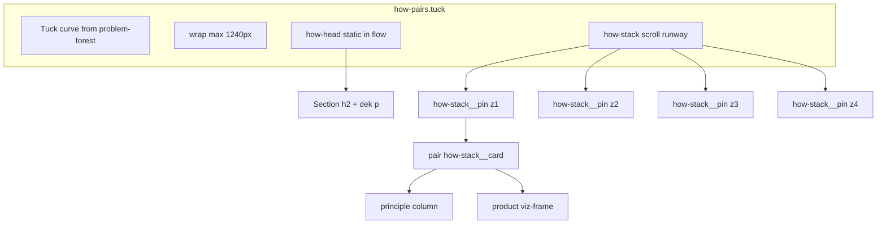
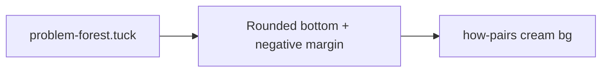
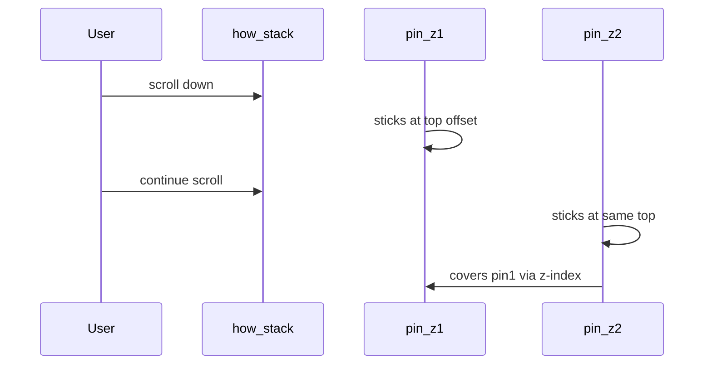

# How Section — Engineer Replication Guide

Handoff documentation for replicating **Section 3: How It Works** (`#how`) from the FocusHacker marketing site as-is: look, scroll-driven card stacking, section tuck transition, typography hierarchy, and in-card product mocks.

**Source of truth (do not use legacy flat layout):**

| Asset | Path | Approx. lines |
|-------|------|---------------|
| Markup | `index.html` | `#how` ~277–710 |
| Styles | `styles-v3.css` | tuck ~91–120; how block ~3145–3827; mocks ~845–2029 |
| Sticky stack JS | `src/how-stack.js` | full file |
| Mock slideshow JS | `src/how-mocks.js` | full file |
| Page entry | `src/main.js` | calls `initHowMocks()` + `initHowStack()` |

**Not authoritative:** `_archive/index-v3.html` uses flat `.pair` rows without `.how-stack` sticky behavior.

---

## 1. Overview and goals

### Purpose

The How section presents four **principle + product** pairs on a warm cream background (`--bg`). Each pair explains one product pillar (copy left or right) beside a marketing UI mock (product column). As the user scrolls, four cards **stack and hand off** in the viewport—creating a snap-like rhythm without CSS scroll-snap.

### Critical behavior clarification

There is **no `scroll-snap-type`** in this implementation. The “snapping” feel comes from:

1. **Overlapping `position: sticky` wrappers** (`.how-stack__pin`), each pinned at the same `top` offset.
2. **Increasing `z-index`** (1 → 4) so each new card covers the previous.
3. A **tall scroll runway** on `.how-stack` (`min-height` from four “steps”) so the browser has enough scroll distance for four handoffs.

### Architecture



| Layer | Role | Scroll behavior |
|-------|------|-----------------|
| `.how-head` | Section title + one-line dek | Normal document flow — **scrolls away** before stack dominates |
| `.how-stack` | Tall container | Provides vertical scroll runway |
| `.how-stack__pin` | Sticky wrapper per card | Pins at `--stack-top` while user scrolls through stack |
| `.how-stack__card.pair` | Card chrome (border, shadow, grid) | Lives inside pin; next pin paints over it |

---

## 2. Prerequisites and dependencies

### Fonts

Load in `<head>` (see `index.html`):

- **Space Grotesk** — `--font-display` (section `h2`, card `h3`)
- **System UI stack** — `--font-sans` (body, dek, bullets)
- **JetBrains Mono** — `--font-mono` (`.num` step labels)

Example:

```html
<link href="https://fonts.googleapis.com/css2?family=JetBrains+Mono:wght@400;500&family=Space+Grotesk:wght@500;600;700&display=swap" rel="stylesheet">
```

### Upstream section (tuck)

Immediately before `#how`, the page must include **`section.problem-forest.tuck`** (dark charcoal). The How section uses **`section.how-pairs.tuck`** (cream). Without the preceding `.tuck` section and z-index stacking, the curved transition between Problem and How will not render correctly.

### Fixed navigation offset

Sticky pins use `--stack-top`:

- **Desktop (>980px):** `88px`
- **Mobile (≤980px):** `72px`

Tune these to match your fixed nav height in the target project.

### Build / script loading

- CSS: link `styles-v3.css` (or port the rules listed in this doc).
- JS: Vite bundles `src/main.js`, which imports and runs How section init. Minimum integration:

```js
import { initHowStack } from "./how-stack.js";
import { initHowMocks } from "./how-mocks.js";

initHowMocks();
initHowStack();
```

Run after DOM is parseable (module script at end of `<body>` is sufficient).

---

## 3. DOM contract

### Section shell (skeleton)

```html
<section class="how-pairs tuck" id="how" aria-labelledby="how-heading">
  <div class="wrap">
    <div class="how-head">
      <h2 id="how-heading">FocusHacker <em>Removes friction</em> so you can focus on what matters.</h2>
      <p>Four integrated systems, one rhythm — principle on the left, product on the right.</p>
    </div>

    <div class="how-stack" aria-label="FocusHacker works">

      <!-- Pair 1: normal -->
      <div class="how-stack__pin">
        <article class="pair how-stack__card">
          <div class="principle">
            <span class="num">01</span>
            <h3>…</h3>
            <p class="principle-lede">…</p>
            <ul class="bullets">…</ul>
          </div>
          <div class="product">
            <div class="viz-frame">
              <!-- Pair 1 mock: id="focusSessionMock" -->
            </div>
          </div>
        </article>
      </div>

      <!-- Pair 2: reverse -->
      <div class="how-stack__pin">
        <article class="pair reverse how-stack__card">
          <!-- principle + product; id="blockedItemsMock" -->
        </article>
      </div>

      <!-- Pair 3: normal — id="guidedSessionMock" -->
      <!-- Pair 4: reverse — id="visualProgressMock" -->

    </div>
  </div>
</section>
```

### Critical DOM rules

1. **One `.how-stack__pin` per card** — the pin is sticky; the card is the visual surface inside it.
2. **Section `h2` stays outside `.how-stack`** — never inside a pin, or the title will stick or collide with cards.
3. **Exactly four pins** — CSS runway math assumes four steps (`min-height: calc(var(--stack-step) * 4 - 32px)`).
4. **Alternating layout** — pairs 2 and 4 add class `reverse` on the `<article>`.

### Pair class matrix

| Pair | `#` | Article classes | Desktop column order |
|------|-----|-----------------|----------------------|
| 1 | 01 | `pair how-stack__card` | Principle left, product right |
| 2 | 02 | `pair reverse how-stack__card` | Product left, principle right |
| 3 | 03 | `pair how-stack__card` | Principle left, product right |
| 4 | 04 | `pair reverse how-stack__card` | Product left, principle right |

Mobile (≤980px): grid becomes single column; `.reverse` order resets to principle then product (see CSS).

### Principle column structure (each card)

```html
<div class="principle">
  <span class="num">01</span>
  <h3>Title with optional <em>accent</em>.</h3>
  <p class="principle-lede">Lead sentence.</p>
  <ul class="bullets">
    <li>Bullet one</li>
  </ul>
</div>
```

### Product column structure (each card)

```html
<div class="product">
  <div class="viz-frame">
    <!-- Mock root with required id (see §9) -->
  </div>
</div>
```

### Required element IDs (JavaScript)

| Pair | Root ID | Additional IDs / selectors |
|------|---------|----------------------------|
| 1 | `focusSessionMock` | `focusSessionSelector`, `focusSessionName`, `focusSessionMeta`, `focusSessionConfig`, `focusSessionStage`, `focusSessionCta`, `focusSessionTimer`, `focusSessionCycle` |
| 2 | `blockedItemsMock` | `.blocked-items-view` (3 slides) |
| 3 | `guidedSessionMock` | `.guided-session-view` with `data-view="countdown|focus|rest"`; `[data-guided-timer]` with `data-initial-min` / `data-initial-sec` |
| 4 | `visualProgressMock` | `.visual-progress-view` with `data-view="levels|weekly-streaks|weekly-goal"` |

If any required node is missing, the corresponding `init*` function exits early (no throw).

### Accessibility

- `section[aria-labelledby="how-heading"]`
- `h2#how-heading` on section title
- Mocks use `aria-live="polite"` and dynamic `aria-label` updates during slideshows

---

## 4. Section tuck transition (curve into cream)

The How section does not exist in isolation. It connects to the dark Problem section via a **global tuck system**.

### Tuck CSS (global)

```css
.tuck {
  border-bottom-left-radius: var(--tuck-r);
  border-bottom-right-radius: var(--tuck-r);
  margin-bottom: calc(var(--tuck-r) * -1);
}
.tuck + section,
.tuck + footer {
  padding-top: calc(var(--section-pad) + var(--tuck-r));
}
```

`--tuck-r` is `54px` in `:root`.

### Z-index stacking (page-wide)

Earlier sections sit **on top** so rounded bottoms reveal the next section’s background:

```css
.problem-forest  { position: relative; z-index: 19; }
.how-pairs       { position: relative; z-index: 18; }
```

### How section surface

```css
.how-pairs {
  background: var(--bg);   /* #F9F7F4 */
  padding: var(--section-pad) 0 80px;
}
```

Because `problem-forest.tuck` precedes `how-pairs`, the How section also receives **extra top padding** from `.tuck + section` (section pad + tuck radius).

### Tuck mechanics (diagram)



1. Outgoing section gets rounded bottom corners and `margin-bottom: -54px`.
2. Incoming section is pulled up; its background shows through the curve.
3. Incoming section gets compensating `padding-top`.

---

## 5. Typography: section headline vs card sub-headings

Use **three distinct tiers**. Do not reuse section `h2` styles for card `h3`.

### Tier 1 — Section headline (`.how-head`)

**Position:** Centered block above the stack; scrolls off normally.

| Element | CSS |
|---------|-----|
| `.how-head` | `text-align: center; max-width: 880px; margin: 0 auto 40px` (48px bottom at ≤980px) |
| `h2` | `font-family: var(--font-display); font-size: clamp(44px, 5.6vw, 76px); line-height: 0.98; letter-spacing: -0.025em; margin: 16px 0 14px` |
| `h2 em` | `font-style: normal; color: var(--flame)` — accent, not italic |
| `p` (dek) | `font-size: 17.5px; color: var(--ink-3); max-width: 640px; margin: 0 auto; line-height: 1.6; font-family: var(--font-sans)` |

### Tier 2 — Card sub-headings (`.principle h3`)

**Position:** Inside sticky card, principle column; left-aligned on desktop.

| Element | Desktop (stack active) | Mobile (≤980px) |
|---------|------------------------|-----------------|
| Column | Grid column `1fr` in `1fr 1.1fr` | Stacked above product (`1fr` grid) |
| Vertical align | `justify-content: center` in flex principle column | `justify-content: flex-start` |
| `h3` | `clamp(34px, 3.8vw, 52px)`, `line-height: 1.04`, `letter-spacing: -0.022em` | `clamp(28px, 7vw, 40px)` |
| `h3 em` | `font-style: normal; color: var(--flame)` | same |

### Tier 3 — Lede and bullets

| Element | CSS |
|---------|-----|
| `.principle-lede` | `font-size: 18px; color: var(--ink-2); line-height: 1.6; margin-bottom: 24px; max-width: 480px` |
| `.num` | 38×38px pill, `font-family: var(--font-mono)`, `background: var(--flame-soft)`, `color: var(--flame)` |
| `.bullets li` | `font-size: 15.5px` (14.5px in mobile stack); flame dot via `li::before` (6px circle) |

### Scroll behavior summary

| Text | Sticky? |
|------|---------|
| Section `h2` + dek | No — standard flow |
| Card `h3`, lede, bullets | Inside sticky pin — moves with card handoff |

**Hierarchy intent:** Section title reads as a “chapter” (~44–76px, centered). Card titles read as “steps” (~34–52px, left in card) as each card snaps through the viewport.

---

## 6. Sticky card stack (core interaction)

### Mental model



Each pin occupies one **viewport slot**. The stack container is taller than four slots combined so the user must scroll through four handoffs.

### CSS custom properties (on `.how-stack`)

| Variable | Desktop value | Purpose |
|----------|---------------|---------|
| `--stack-top` | `88px` (72px at ≤980px) | `top` for all sticky pins |
| `--stack-slot` | `min(calc(100vh - var(--stack-top) - 24px), 760px)` | Pin wrapper height |
| `--stack-step` | `calc(var(--stack-slot) + 32px)` | Scroll distance per card |
| `--stack-viz-h` | `380px` (fluid on mobile) | Product panel height inside card |
| `--stack-card-pad-block` | `clamp(40px, 4.5vw, 56px)` | Vertical padding inside card |
| `--stack-card-h` | `calc(var(--stack-viz-h) + 2 * var(--stack-card-pad-block))` | Fixed card height (desktop) |
| `--stack-viz-content-min` | `274px` | Min height for mock content areas |

**Stack runway (desktop):**

```css
.how-stack {
  position: relative;
  min-height: calc(var(--stack-step) * 4 - 32px);
}
```

The `- 32px` accounts for one fewer inter-step gap than four full steps.

### Sticky pins

```css
.how-stack__pin {
  position: sticky;
  top: var(--stack-top);
  height: var(--stack-slot);
  display: flex;
  align-items: center;
}
.how-stack__pin:nth-child(1) { z-index: 1; }
.how-stack__pin:nth-child(2) { z-index: 2; }
.how-stack__pin:nth-child(3) { z-index: 3; }
.how-stack__pin:nth-child(4) { z-index: 4; }
```

When stack is active (not `.how-stack--static`), pins use `align-items: flex-start` and `padding-block: 10px`.

### Card surface (`.how-stack__card`)

```css
.how-stack__card {
  width: 100%;
  background: var(--bg);
  border: 1px solid var(--line);
  border-radius: var(--r-2xl);
  box-shadow: var(--shadow-lg);
  box-sizing: border-box;
}
```

Active stack cards (not static):

```css
.how-stack:not(.how-stack--static) .how-stack__card.pair {
  height: var(--stack-card-h);
  min-height: var(--stack-card-h);
  max-height: var(--stack-card-h);
  align-items: stretch;
}
```

### Pair grid inside card

```css
.pair {
  display: grid;
  grid-template-columns: 1fr 1.1fr;
  gap: 80px;
  align-items: center;
}
.how-stack__card.pair {
  padding: clamp(40px, 4.5vw, 56px) clamp(36px, 4vw, 64px);
}
.pair.reverse .principle { order: 2; }
.pair.reverse .product   { order: 1; }
```

### Principle / product alignment in stack

```css
.how-stack:not(.how-stack--static) .principle {
  display: flex;
  flex-direction: column;
  justify-content: center;
  min-height: 0;
}
.how-stack:not(.how-stack--static) .product .viz-frame {
  height: var(--stack-viz-h);
  min-height: var(--stack-viz-h);
  max-height: var(--stack-viz-h);
  /* flex column; overflow hidden */
}
```

---

## 7. Responsive behavior

| Breakpoint | Stack | Headline / h3 | JS |
|------------|-------|---------------|-----|
| **>980px** | CSS runway + fixed card height | h2 large; principle vertically centered in card | `initHowStack` clears mobile metrics |
| **≤980px** | Sticky + measured slots; auto card height; 32px gap between pins | Smaller h3; principle top-aligned | `measureMobileStack()` runs |
| **≤620px** | Same as mobile | Tighter card/viz padding | Same |
| **`prefers-reduced-motion: reduce`** | `.how-stack--static` flat list | No motion | No mobile measure; mocks don’t auto-play |

### Mobile CSS highlights (≤980px)

```css
.how-stack:not(.how-stack--static) {
  --stack-top: 72px;
  --stack-viz-h: clamp(220px, 38vh, 300px);
  min-height: 0; /* JS sets inline min-height */
}
.how-stack:not(.how-stack--static) .how-stack__pin {
  height: auto;
  min-height: var(--stack-slot, min(calc(100dvh - var(--stack-top) - 16px), 520px));
}
.how-stack:not(.how-stack--static) .how-stack__pin:not(:last-child) {
  margin-bottom: 32px;
}
.how-stack:not(.how-stack--static) .how-stack__card.pair {
  height: auto;
  min-height: auto;
  max-height: none;
}
.pair { grid-template-columns: 1fr; }
.pair.reverse .principle,
.pair.reverse .product { order: 0; }
```

### Reduced motion — `.how-stack--static`

Applied by JS when `prefers-reduced-motion: reduce`:

```css
.how-stack--static .how-stack__pin {
  position: static;
  height: auto;
  display: block;
  z-index: auto;
}
.how-stack--static .how-stack__pin + .how-stack__pin {
  border-top: 1px solid var(--line);
}
.how-stack--static .how-stack__card {
  border: none;
  border-radius: 0;
  box-shadow: none;
  background: transparent;
}
```

---

## 8. JavaScript specification

### `initHowStack()` — `src/how-stack.js`

**Selector:** `.how-stack` (first match). Exits if missing.

**Media queries:**

- `mqStatic`: `(prefers-reduced-motion: reduce)` → adds `.how-stack--static`
- `mqMobile`: `(max-width: 980px)` → enables height measurement

**Constants:**

- `STEP_GAP = 32` (px between pins on mobile)
- `MIN_SLOT_VH = 0.85` (minimum slot as fraction of viewport)

**`measureMobileStack()` algorithm** (only when mobile + motion allowed + not static):

1. Read `--stack-top` from computed style (fallback `72`).
2. `minSlot = max(320, round(innerHeight * 0.85 - topPx - 16))`.
3. For each pin:
   - Measure `.how-stack__card` height via `getBoundingClientRect()`.
   - `slot = max(cardHeight, minSlot)`.
   - Set inline: `--stack-slot`, `--stack-step-local`, `min-height` on pin.
   - Accumulate `totalFlow += slot + (gap if not last pin)`.
4. Set `stack.style.minHeight = totalFlow + 'px'`.

**Listeners:**

- `mqStatic` / `mqMobile` `change` → `apply()`
- `window` `resize` (debounced 80ms)
- `window` `load`
- `document.fonts.ready` (if available)

**ResizeObserver:** Observes each `.how-stack__card` on mobile to re-run measure when content/fonts change.

**Desktop (>980px):** No inline sizing; relies entirely on CSS `min-height: calc(var(--stack-step) * 4 - 32px)`.

### `initHowMocks()` — `src/how-mocks.js`

Calls, in order:

1. `initFocusSessionMock()`
2. `initBlockedItemsMock()`
3. `initGuidedSessionMock()`
4. `initVisualProgressMock()`

**Shared patterns:**

| Constant | Value | Usage |
|----------|-------|--------|
| `FADE_MS` | 250 | Crossfade duration (CSS matches `0.25s`) |
| Slideshow IO | `threshold: 0.08`, `rootMargin: 0px 0px -5% 0px` | Pairs 2–4 start/stop on visibility |
| Focus session IO | `threshold: 0.15` | Pair 1 preset rotation |

All mocks **skip auto-play** when `prefers-reduced-motion: reduce`.

### Integration (`src/main.js`)

```js
import { initHowStack } from "./how-stack.js";
import { initHowMocks } from "./how-mocks.js";

initHowMocks();
initHowStack();
```

---

## 9. Product mock UI (per pair)

Mocks are **independent of sticky scroll**. They animate only when intersecting the viewport (except reduced motion).

### Pair 1 — Focus session presets (`#focusSessionMock`)

**Behavior:** Cycles four presets every 2000ms with 250ms opacity fade on meta/stage/CTA; selector pulse 150ms on change.

**Presets:** Classic, Expert, Intense, Create Custom (custom shows config panel, hides stage).

**Key classes:**

- `.focus-session-fade` / `.is-fading` — `opacity` transition 0.25s
- `.focus-session-mock--custom` — toggled for custom preset
- `.focus-session-selector--pulse` — brief emphasis on selector

**CSS:** `styles-v3.css` ~845–1063.

### Pair 2 — Blocked items (`#blockedItemsMock`)

**Behavior:** 3 views in `.blocked-items-viewport`; absolute-positioned slides; `setInterval` 2000ms; crossfade via `.is-active` + `.is-fading`.

**Views:** `overview`, `add-website`, `distractions` (class `.blocked-items-view`).

**CSS:** Views default `opacity: 0`; `.is-active` → `opacity: 1`, `z-index: 1`. ~1065–1107.

### Pair 3 — Guided session (`#guidedSessionMock`)

**Behavior:** Timed slide machine (not fixed interval)—each slide has `dwellMs`; after dwell, crossfade to next. Timer elements `[data-guided-timer]` decrement `tickSteps` times at `tickMs` while slide is active.

| Slide `data-view` | dwellMs | tickMs | tickSteps |
|-------------------|---------|--------|-----------|
| `countdown` | 3000 | 1000 | 2 |
| `focus` | 2500 | 833 | 2 |
| `rest` | 2500 | 833 | 2 |

**HTML requirements:** Each view needs `data-view` matching slide id; timer needs `data-initial-min` and `data-initial-sec`.

**CSS:** `.guided-session-view` stack like blocked items. ~1995–2030.

### Pair 4 — Visual progress (`#visualProgressMock`)

**Behavior:** 3 views rotate every 2000ms with 250ms crossfade.

**Views:** `data-view="levels"`, `weekly-streaks`, `weekly-goal` (class `.visual-progress-view`).

**CSS:** Same absolute stack pattern as pair 2. ~1470–1491.

### Viz frame (shared product chrome)

```css
.product .viz-frame {
  background: var(--surface);
  border: 1px solid var(--line);
  border-radius: var(--r-2xl);
  padding: 28px;
  box-shadow: var(--shadow-lg);
  position: relative;
  min-height: 380px;
}
```

Inside active stack, height is locked to `--stack-viz-h` on desktop.

---

## 10. Design tokens

Copy these from `:root` in `styles-v3.css` when porting:

```css
/* Surfaces */
--bg: #F9F7F4;
--surface: #FFFFFF;

/* Text on light */
--ink: #2B2B2B;
--ink-2: #3D3D3D;
--ink-3: #6B6B6B;
--ink-4: #949494;

/* Lines & accent */
--line: rgba(43, 43, 43, 0.10);
--flame: #FF6B2C;
--flame-2: #FF8A55;
--flame-soft: rgba(255, 107, 44, 0.12);

/* Typography */
--font-display: "Space Grotesk", system-ui, sans-serif;
--font-sans: -apple-system, BlinkMacSystemFont, "Segoe UI", "Helvetica Neue", sans-serif;
--font-mono: "JetBrains Mono", ui-monospace, "SF Mono", Menlo, monospace;

/* Layout rhythm */
--section-pad: 112px;   /* 80px at ≤620px */
--tuck-r: 54px;
--pair-pad: 56px;       /* 44px at ≤620px */

/* Geometry & elevation */
--r-2xl: 36px;
--shadow-lg: 0 30px 80px rgba(26, 26, 31, 0.12), 0 8px 22px rgba(26, 26, 31, 0.06);
```

**Layout wrapper:**

```css
.wrap { max-width: 1240px; margin: 0 auto; padding: 0 32px; }
```

At ≤980px, `.how-pairs .wrap` uses `padding-inline: clamp(16px, 4vw, 24px)`.

---

## 11. Implementation order (checklist)

1. [ ] Add global **tuck** rules and z-index for `problem-forest` → `how-pairs`.
2. [ ] Build **`how-pairs`** section shell with cream background and padding.
3. [ ] Add **`.how-head`** with centered `h2` + dek (**outside** `.how-stack`).
4. [ ] Add four **`.pair`** content blocks (copy + static HTML for mocks).
5. [ ] Wrap each pair in **`.how-stack__pin` > `.how-stack__card`**; add `reverse` on pairs 2 and 4.
6. [ ] Port **sticky stack CSS** (variables, pins, z-index, card heights, principle/product grid).
7. [ ] Port **mock component CSS** (focus session, blocked items, guided session, visual progress).
8. [ ] Wire **`initHowStack()`** and **`initHowMocks()`**; verify breakpoint `980px` matches CSS and JS.
9. [ ] Add **responsive** overrides (980px, 620px) and **`.how-stack--static`** rules.
10. [ ] Run **QA** (§12).

---

## 12. QA / acceptance criteria

### Desktop (>980px)

- [ ] Section tuck shows a smooth curve from dark Problem into cream How.
- [ ] Section `h2` scrolls away; it never sticks at the top.
- [ ] Four distinct sticky handoffs as user scrolls through the stack.
- [ ] Each new card fully covers the previous (z-index 2 over 1, etc.).
- [ ] Pairs 2 and 4 show product on the left, principle on the right.
- [ ] Card heights are uniform; product mocks do not clip vertically.

### Mobile (≤980px)

- [ ] Cards are not clipped; full content visible per pin.
- [ ] Stack is tall enough to scroll through all four cards with sticky behavior.
- [ ] Single-column layout: principle above product.
- [ ] Resizing viewport or loading webfonts re-measures stack (no overlap glitches).

### Reduced motion

- [ ] `.how-stack--static` — vertical list, no sticky overlap.
- [ ] Borders between cards instead of stacked deck.
- [ ] No automatic mock slideshows or preset cycling.

### Mocks

- [ ] Pair 1 cycles presets when mock is on screen.
- [ ] Pairs 2–4 advance slides/views when on screen; pause when off screen.
- [ ] Pair 3 timers tick down briefly on each slide.

---

## 13. Common pitfalls

| Pitfall | Symptom | Fix |
|---------|---------|-----|
| `h2` placed inside `.how-stack` | Title sticks or overlaps cards | Keep `.how-head` as sibling above stack |
| Using CSS `scroll-snap` | Fights sticky physics; wrong feel | Use sticky pins + runway `min-height` only |
| Missing pin z-index | Cards don’t layer | `nth-child` z-index 1 through 4 |
| No tuck on prior section | Hard edge, no curve | Apply `.tuck` on `problem-forest`; set z-index |
| No stack `min-height` | No scroll room; no handoffs | Desktop: `calc(var(--stack-step) * 4 - 32px)`; mobile: JS `totalFlow` |
| Breakpoint mismatch (e.g. 1024 vs 980) | JS measures when CSS expects desktop, or vice versa | Use **980px** in both CSS `@media` and `matchMedia` |
| `--stack-top` wrong for nav | Cards stick under or far below nav | Match nav height (88px / 72px) |
| Fewer than four pins | Runway math wrong | Always four pins or recalculate `min-height` |
| Missing mock IDs | Silent failure; static UI | Match IDs in §3 table |
| Copying `_archive/index-v3.html` | No sticky stack | Use `index.html` structure |

---

## 14. File map

| Concern | File | Notes |
|---------|------|-------|
| HTML structure | `index.html` | `#how` ~277–710 |
| Tuck system | `styles-v3.css` | ~91–120 |
| How layout & stack | `styles-v3.css` | ~3145–3356 |
| Principle / pair grid | `styles-v3.css` | ~3346–3407 |
| Mobile / static stack | `styles-v3.css` | ~3633–3827 |
| Focus session mock CSS | `styles-v3.css` | ~845–1063 |
| Blocked items mock CSS | `styles-v3.css` | ~1065–1200+ |
| Visual progress mock CSS | `styles-v3.css` | ~1470+ |
| Guided session mock CSS | `styles-v3.css` | ~1995+ |
| Sticky stack logic | `src/how-stack.js` | `initHowStack` |
| Mock slideshow logic | `src/how-mocks.js` | `initHowMocks` + four inits |
| Page bootstrap | `src/main.js` | Imports and calls both inits |
| Product copy spec | `Requirements.md` | Section 3 (wording reference) |

---

*Document version aligns with FocusHacker Web repo implementation (sticky stack + modular `how-stack.js` / `how-mocks.js`). Line numbers in source files may drift; search by class names and function names when in doubt.*
